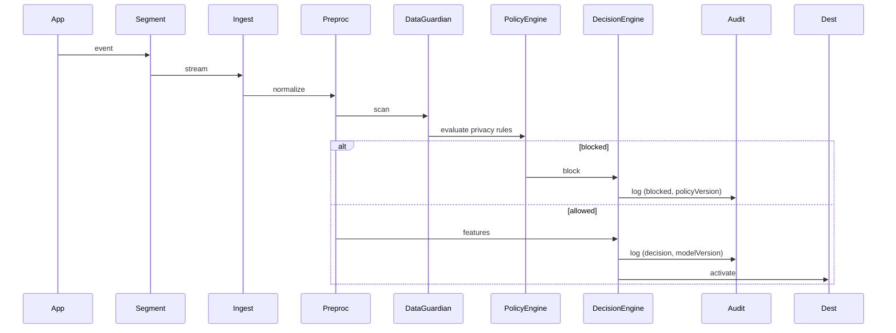

# AI Governance & Decision Layer for Segment — Architecture Document

Last updated: 2026-08-21

## Executive summary
This document describes a production-ready architecture for an AI Governance & Decision Layer that augments a Segment CDP. The layer continuously enforces data governance, detects and remediates PII/privacy issues, provides explainable decisioning (Next-Best-Action, audience activation), and offers comprehensive auditability and human-in-the-loop workflows. It maps requirements from the provided POC notes into components, dataflows, APIs, policies, and rollout guidance.

## Goals and core capabilities
- Continuous PII and sensitive-data discovery and automated remediation (mask/block).
- Policy-as-code consent enforcement and destination restrictions (blocking activations when non-compliant).
- Schema reconciliation, canonical event recommendations, and data-quality root-cause analysis.
- Natural-language segmentation and Customer 360 summarization for marketers and analysts.
- Next-Best-Action (NBA) decisioning combining ML predictions, business rules, consent, and risk policies.
- Immutable, tamper-evident audit trail for every decision (inputs, model versions, policies, explanations).
- Human-in-the-loop UIs for identity merges, policy approvals, and flagged reviews.

## Requirements (extracted)
From the POC notes: PII detection & masking, event/schema canonicalization, duplicate event detection, natural-language-to-audience translation, customer 360 summarizer, identity resolution (HITL), consent-aware audience activation, lineage and compliance reporting, data-quality root-cause analysis, automated remediation suggestions, explainability, and daily governance reports.

## High-level architecture
Components:
- Ingest Layer (Segment → Streaming/Batch)
- Event Preprocessor & Normalizer
- Data Guardian (Agent 1)
- Privacy & Governance Guardian (Agent 2)
- Customer Intelligence Agent (Agent 3)
- Feature Store (online + batch consistency)
- Model Registry & Serving
- Policy Engine (OPA/Cerbos)
- Decision Engine
- Explainability & Risk Assessor
- Audit / Append-only Store
- Monitoring & Drift Detection
- Human Review UI
- Activation / Destination Connectors
- Auth & Secrets (IAM, Vault)

Architecture diagram (conceptual):

```mermaid
flowchart LR
  subgraph Source
    A[Segment Events]
  end
  subgraph Ingest
    B[Streaming (Kafka)]
    C[Batch Landing (S3, Warehouse)]
  end
  subgraph AI_COPILOT
    D[Event Preprocessor]
    E[Data Guardian]
    F[Privacy & Governance Guardian]
    G[Customer Intelligence Agent]
    H[Feature Store]
    I[Model Serving]
    J[Decision Engine]
    K[Policy Engine]
    L[Explainability & Risk]
    M[Audit Log]
    N[Human Review UI]
  end
  subgraph Destinations
    O[Segment Destinations / Ads / CRM]
  end

  A --> B --> D
  A --> C --> D
  D --> E --> F
  E --> M
  F --> M
  D --> H
  H --> I
  I --> J
  J --> K
  K --> J
  J --> M
  J --> O
  J --> N
  L --> M
  G --> I
  G --> J
```

## Component responsibilities (detailed)

### Ingest Layer
- Collect events from Segment in real time and batch.
- Persist raw WORM landing copy (S3) for lineage and compliance.
- Kick off preprocessing pipelines (stream or batch).

### Event Preprocessor & Normalizer
- Schema validation and version detection.
- Basic enrichment and canonicalization (field normalization).
- Pseudonymization/tokenization of identifiers when available.
- Forward normalized payloads to Data Guardian.

### Data Guardian (Agent 1)
- PII/sensitive-data detection using deterministic rules (regex), heuristics, and ML/LLM-backed classifier.
- Schema reconciliation: detect duplicate/inconsistent event names and recommended canonical events.
- Data-quality detection and root-cause hints (e.g., new client version introduced altered field names).
- Flag and optionally auto-remediate events (mask/remove sensitive fields) based on policy.
- Provide suggested fixes and mapping rules via HITL UI.

### Privacy & Governance Guardian (Agent 2)
- Enforce consent checks and destination restrictions at activation time.
- Evaluate policy-as-code (OPA/Cerbos) against event/context.
- Maintain lineage (OpenLineage) and retention enforcement.
- Produce daily compliance audits and remediation suggestions.

### Customer Intelligence Agent (Agent 3)
- Customer 360 summarizer (aggregate signals and generate natural language summaries).
- Natural-language to audience translation (LLM with domain prompts + deterministic post-processing).
- Propensity & NBA models for decisioning (scoring and feature explainability).
- Identity resolution helper (similarity scoring + HITL merge flows).

### Feature Store
- Versioned, consistent features for batch training and low-latency serving.
- Online store (Redis/Dynamo) and batch store (Parquet/Snowflake).

### Model Registry & Serving
- Model artifacts in registry (MLflow/Artifact store) with metadata: version, owner, tests, signature, checksum, policy approvals.
- Serving layer (Seldon/KFServing/Triton) or serverless inference for low-latency needs.

### Policy Engine
- Policies stored as code (YAML/JSON + tests).
- Runtime evaluator (OPA Rego or Cerbos) with snapshot capability (policy version used is recorded in audit).

### Decision Engine
- Orchestrates scoring + business rules + policy enforcement.
- Combines outputs to produce final action: allow, block, mask, modify, review, or route to destination.
- Returns structured reasons and confidence.

### Explainability & Risk Assessor
- Local explanations (SHAP/LoR) for high-impact decisions.
- Global fairness and drift analysis.
- Produce a risk score per decision to route high-risk cases for review.

### Audit / Append-only Store
- Append-only audit records with all inputs, outputs, model/policy snapshots, explanations, and signatures.
- Store in WORM S3 + ledger (optional QLDB) for tamper-evidence.

### Human Review UI
- Dashboard for queues (PII detections, identity merges, non-consent audiences).
- Inline fixes (mask PAN) with one-click remediation and audit logging.
- RBAC-driven approvals.

### Monitoring & Observability
- Metrics (Prometheus) for event volume, percent blocked, false-positive trends.
- Model monitoring (Evidently/WhyLogs) for drift and performance.

## Dataflows & sequence examples

### 1) Event ingestion with PII detection and activation gating


### 2) Audience creation via natural language
- Marketer sends NL request: "High-value India customers likely to buy premium card"
- NL→LLM translates into attribute filter and propensity threshold
- Candidate audience is materialized in Feature Store / Warehouse
- Privacy Guardian checks consent & PII
- Decision Engine returns recommended remediation (exclude non-consented, mask fields)
- Final audience exported to destinations

## Decision API (OpenAPI-style summary)

POST /v1/decide
- request:
  - request_id: string
  - event_id: string
  - profile_id: string (tokenized)
  - features: object or feature_refs
  - context: { source, destination, activation_type }
- response:
  - audit_id: uuid
  - decision: { action: allow|deny|review|modify, reason_codes: [], score }
  - model: { id, version }
  - policies: [{ id, verdict }]
  - explanation_url: string

GET /v1/audit/{audit_id}
- returns full audit record

POST /v1/policy/simulate
- runs an event against a set of policy snapshots for testing

## Audit record schema (example)
```json
{
  "audit_id": "uuid",
  "timestamp": "2026-08-21T12:34:56Z",
  "source_event_id": "evt_123",
  "input_snapshot": {"email":"tok_abc","income":"MASKED","pan":"REDACTED",...},
  "model": {"id":"propensity_v1","version":"1.2.3","artifact_checksum":"sha256:..."},
  "model_outputs": {"score":0.87,"top_features":[{"f":"ltv","v":0.6}]},
  "policies_applied": [{"policy_id":"policy_admkt_consult","result":"deny"}],
  "decision": {"action":"modify","masked_fields":["pan","income"]},
  "explanation_ref": "s3://audit/explanations/audit_id.json",
  "lineage": {"upstream": ["core_banking","app_v4.2"]},
  "signature": "govsig:v1:..."
}
```

## Policy examples (pseudo)

- Advertising activation requires marketing_consent == true
- PAN and full_card_number must be removed before any marketing destination
- Income may be used for eligibility scoring but must be masked for ads
- Audiences with >1% non-consenting members are blocked from ad destinations

## Example OPA Rego snippet (pseudo)
```rego
package governance.ad_activation

default allow = false

allow {
  input.destination == "google_ads"
  input.event.marketing_consent == true
}
```

## Explainability & fairness checks
- Per-decision: compute local feature contributions (SHAP-like) and embed short explanation in audit.
- Per-model: compute parity/fairness metrics by protected attributes (if available), run monthly fairness reports, and block model promotion if thresholds exceeded.

## Human-in-the-loop patterns
- Identity resolution: show candidate merges with confidence and allow [Merge | Reject | Review]
- Policy exceptions: request governance approval with audit trail
- Event fixes: show suggested canonical name/property mapping; one-click apply updates live mapping rules

## Tech stack recommendations
- Streaming & ingest: Segment → Kafka or Kinesis
- Raw store: S3 with WORM (immutable) policy
- Warehouse: Snowflake / BigQuery
- Feature Store: Feast (online store Redis/Dynamo + batch Parquet)
- Model registry: MLflow or artifact store
- Model serving: Seldon Core / KFServing / Triton
- Policy engine: Open Policy Agent (OPA) or Cerbos
- PII detection: deterministic + ML classifier; LLM for suggestion only (private LLM preferred)
- Lineage: OpenLineage / Marquez
- Audit: Append-only S3 + optional ledger (QLDB)
- Secrets / IAM: HashiCorp Vault and OIDC
- Observability: Prometheus, Grafana, Evidently, whylogs
- CI/CD & GitOps: GitHub Actions + ArgoCD
- UI: React + Role-based backend (Node/Flask)

## Security and compliance considerations
- Tokenize/pseudonymize identifiers early; do not store raw PII in accessible stores.
- Encrypt audit logs; enforce WORM for regulatory needs.
- Snapshot policy versions and model artifact checksums per audit.
- RBAC: separate deploy vs governance roles; require human approval for risky toggles.

## Operational runbooks
- Shadow mode rollout
  - Start in shadow: log suggested actions without enforcement for 2-4 weeks.
  - Collect false-positive rate, adjust classifiers and thresholds.
- Enforcement rollout
  - Enable auto-mask/auto-block per-destination after approval.
  - Require manual approval for enforcement on high-impact destinations.
- Incident rollback
  - Disable enforcement via feature flag, revert mapping rules, preserve audit trail.

## Rollout plan (phased)
1. PoC — Shadow Data Guardian (PII detection + canonical event suggestions)
2. Consent enforcement for ad destinations (Privacy Guardian): block activations when non-consent.
3. NL→Segment audience MVP + Customer 360 summarizer (Agent 3) in assist mode.
4. Decision Engine + low-latency NBA for opt-in product flows; enable HITL for high-risk decisions.
5. Full automation with retraining, fairness gating, and scheduled audits.

## Metrics & KPIs
- PII detections per million events
- False positive rate for PII classification
- Percent of activations blocked due to consent
- Model performance (AUC, precision@k) and drift rate
- Time-to-resolution for HITL reviews
- Audit completeness: percent of decisions with full snapshots

## Sample deliverables and next steps
- OpenAPI spec for Decision API and Audit endpoints (can be generated next).
- Prototype repo scaffolding: preprocessor, policy adapter, decision engine mock, UI skeleton.
- Policy unit test harness and sample policy repo.

---

For convenience I saved this file to:
`/Users/akhil/Desktop/AIGovernanceDemo/AI_Governance_Decision_Layer_Architecture.md`

If you want, I can now:
- Generate the OpenAPI spec (decision and audit endpoints).
- Scaffold the prototype repo (microservices + simple mock model + UI) and run initial local tests.
- Produce a slide-ready PDF summary.

Which should I do next?